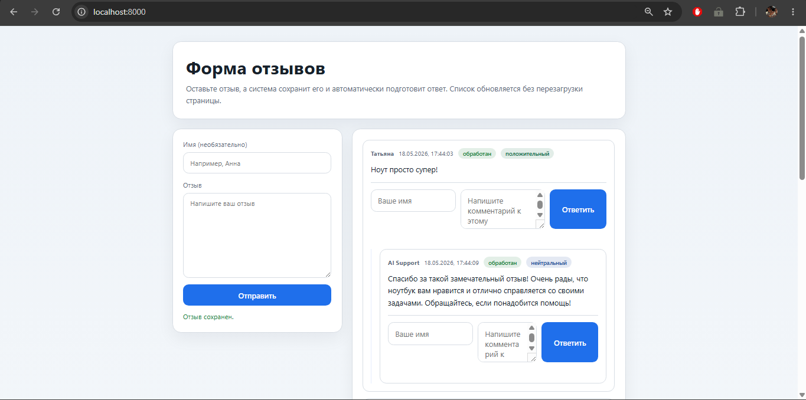
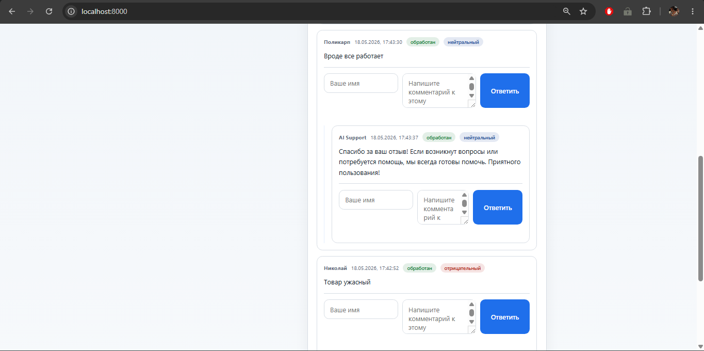

<div align="center">

# 🤖 AI Review Handler


**Автоматическая обработка отзывов с ИИ-ответами 24/7**

[Описание](#-описание-проекта) • [Технологии](#-технологии) • [Архитектура](#-архитектура) • [Скриншоты](#-скриншоты) • [Установка](#-установка-и-настройка) • [Структура](#-структура-проекта) • [Компоненты](#-детальное-описание-компонентов) • [Лицензия](#-лицензия) • [Заключение](#-заключение) • [Контакты](#-контакты)

</div>

---

## 📋 Описание проекта

**AI Review Handler** — это микросервисная система для автоматической обработки отзывов клиентов с генерацией ИИ-ответов. Проект объединяет веб-приложение для отображения отзывов и фоновый worker для их автоматической обработки через OpenAI API.

### Основные возможности

- 🌐 **Веб-интерфейс** — просмотр и управление отзывами через FastAPI + HTML-шаблоны
- 🤖 **ИИ-ответы** — автоматическая генерация ответов через OpenAI (ProxyAPI)
- 🎯 **Анализ тональности** — определение позитива/негатива/нейтральности по ключевым словам
- ⚡ **Фолбэк-логика** — работа без OpenAI через шаблонные ответы
- 🔁 **Idempotency** — защита от повторной обработки через state file
- 🔔 **Telegram-уведомления** — опциональные алерты о новых отзывах
- 🐳 **Docker-развёртывание** — полный стек в одном `docker-compose.main.yml`

### Бизнес-цель

**Проблема:** Малый бизнес и сервисные компании не успевают оперативно отвечать на отзывы клиентов. Задержка ответа снижает доверие, упускаются возможности для улучшения сервиса, негативные отзывы остаются без реакции.

**Решение:** Система автоматически обрабатывает каждый отзыв за 10–30 секунд: анализирует тональность, генерирует контекстный ответ и помечает как обработанный. Это обеспечивает мгновенную реакцию 24/7 без участия человека.

---

## 🛠 Технологии

| Категория | Технологии |
|-----------|------------|
| **Язык программирования** | Python 3.12+ |
| **Backend API** | FastAPI, Uvicorn, Pydantic v2 |
| **LLM & Embeddings** | OpenAI GPT-4.1-mini (через ProxyAPI) |
| **Основная БД** | PostgreSQL 15+ (asyncpg, SQLAlchemy) |
| **HTTP-клиенты** | httpx, AsyncOpenAI SDK |
| **Инфраструктура** | Docker, Docker Compose |
| **Настройки** | pydantic-settings, dotenv |

---

## 🏗 Архитектура

```
┌────────────────────────────────────────────────────────────────┐
│                     Веб-приложение (app_test)                  │
│              FastAPI + PostgreSQL + HTML-шаблоны               │
│                                                                │
│  ┌──────────────┐  ┌──────────────┐  ┌──────────────┐          │
│  │   GET/POST   │  │  GET/PATCH   │  │   Главная    │          │
│  │  /api/reviews│  │ /api/reviews │  │   /index     │          │
│  └──────────────┘  └──────────────┘  └──────────────┘          │
└────────────────────────────────────────────────────────────────┘
                              │
                              ▼ (REST API + X-Worker-Token)
┌────────────────────────────────────────────────────────────────┐
│                   AI-обработчик (ai_handler)                   │
│                      Worker (asyncio + httpx)                  │
│                                                                │
│  ┌─────────────────────────────────────────────────────────┐   │
│  │                    worker.py (loop)                     │   │
│  │  poll → fetch → process → create/update → state.save    │   │
│  └─────────────────────────────────────────────────────────┘   │
│              │                    │                    │       │
│              ▼                    ▼                    ▼       │
│  ┌────────────────┐  ┌────────────────┐  ┌────────────────┐    │
│  │   client.py    │  │  processor.py  │  │ telegram_bot.py│    │
│  │                │  │                │  │                │    │
│  │ • fetch()      │  │ • detect_tone()│  │ • notify()     │    │
│  │ • create()     │  │ • generate()   │  │                │    │
│  │ • update()     │  │   (OpenAI)     │  │                │    │
│  └────────────────┘  └────────────────┘  └────────────────┘    │
└────────────────────────────────────────────────────────────────┘
                              │
              ┌───────────────┼───────────────┐
              ▼               ▼               ▼
    ┌─────────────────┐ ┌──────────────┐ ┌──────────────┐
    │   PostgreSQL    │ │  OpenAI API  │ │   Telegram   │
    │   (reviews)     │ │  (ProxyAPI)  │ │   Bot API    │
    └─────────────────┘ └──────────────┘ └──────────────┘
```

---

## 📸 Скриншоты

### Главная страница



### Карточки отзывов с ИИ-ответом



---

## 🚀 Установка и настройка

### Предварительные требования

- Python 3.12+ (для локального запуска)
- Docker Desktop
- API-ключ OpenAI (ProxyAPI)

### Клонирование репозитория

```bash
git clone <repository-url>
cd ai-parser-n-handler
```

### Настройка переменных окружения

Создайте `.env` в корне проекта:

```powershell
copy .env.example .env
```

Отредактируйте `.env`, внеся свои ключи

### Запуск через Docker Compose

```powershell
docker-compose -f docker-compose.main.yml up --build
```

Или в фоновом режиме:

```powershell
docker-compose -f docker-compose.main.yml up -d --build
```

### Проверка работы

```powershell
# Статус контейнеров
docker-compose -f docker-compose.main.yml ps

# Логи worker'а
docker-compose -f docker-compose.main.yml logs worker --tail=30

# API отзывов
curl http://localhost:8000/api/reviews
```

Приложение доступно по адресу: **http://localhost:8000**

---

## 📁 Структура проекта

```
ai-parser-n-handler/
├── docker-compose.main.yml      # Запуск всего стека (db + app + worker)
├── .env.example                 # Шаблон переменных окружения
├── .gitignore                   # Исключения для Git
├── LICENSE                      # Лицензия MIT
├── README.md                    # Документация проекта
│
├── app_test/                    # Веб-приложение (FastAPI)
│   ├── main.py                  # Точка входа FastAPI
│   ├── config.py                # Настройки (Pydantic Settings)
│   ├── requirements.txt         # Зависимости
│   ├── Dockerfile               # Образ для контейнера
│   ├── docker-compose.yml       # Запуск app + db (отдельно)
│   │
│   ├── api/
│   │   ├── routes.py            # API роуты (GET/POST/PATCH /api/reviews)
│   │   └── __init__.py
│   │
│   ├── db/
│   │   ├── session.py           # Async sessionmaker + engine
│   │   ├── base.py              # SQLAlchemy declarative base
│   │   └── __init__.py
│   │
│   ├── models/
│   │   ├── review.py            # SQLAlchemy модель Review
│   │   └── __init__.py
│   │
│   ├── templates/
│   │   └── index.html           # Главная страница (отзывы)
│   │
│   ├── schemas.py               # Pydantic модели для API
│   └── __init__.py
│
├── ai_handler/                  # AI-обработчик (Worker)
│   ├── worker.py                # Точка входа, главный цикл
│   ├── config.py                # Настройки (Pydantic Settings)
│   ├── models.py                # Pydantic модели (RemoteReview, payload)
│   ├── requirements.txt         # Зависимости
│   ├── Dockerfile               # Образ для контейнера
│   ├── docker-compose.yml       # Запуск worker (отдельно)
│   ├── .env.example             # Шаблон переменных окружения
│   │
│   ├── client.py                # HTTP-клиент для REST API сайта
│   ├── processor.py             # Логика: tone detection + AI response
│   ├── state.py                 # State file (защита от дубликатов)
│   ├── telegram_bot.py          # Отправка уведомлений в Telegram
│   └── __init__.py
│
└── screenshots/                 # Скриншоты               
```

---

## 📖 Детальное описание компонентов

### Веб-приложение (`app_test/`)

**Основная задача:** Предоставить REST API для CRUD-операций с отзывами и веб-интерфейс для просмотра.

**API Endpoints:**

| Метод | Путь | Описание |
|-------|------|----------|
| `GET` | `/` | Главная страница (HTML) |
| `GET` | `/api/reviews` | Список всех отзывов |
| `POST` | `/api/reviews` | Создание нового отзыва |
| `PATCH` | `/api/reviews/{id}` | Обновление отзыва (только с X-Worker-Token) |

**Модель данных (Review):**

```python
class Review:
    id: int
    parent_id: int | None
    name: str
    text: str
    status: "new" | "processed" | "archived"
    response: str | None
    tone: "positive" | "negative" | "neutral" | None
    created_at: datetime
```

**Защита от worker'а:** Все PATCH-запросы требуют заголовок `X-Worker-Token` с токеном из `WORKER_API_TOKEN`.

---

### AI-обработчик (`ai_handler/`)

**Основная задача:** Периодически опрашивать сайт, обрабатывать новые отзывы и создавать ответы.

**worker.py — главный цикл:**

```python
while True:
    await client.check_site()                    # Проверка доступности
    reviews = await client.fetch_new_reviews()   # GET /api/reviews?status=new
    
    for review in reviews:
        response_text = await processor.generate_response(review.text)
        await client.create_review(review.id, response_text)
        await client.update_review(review.id, status="processed")
        state.mark_review_as_processed(review.id)
    
    await asyncio.sleep(settings.worker_poll_interval)
```

**client.py — HTTP-клиент:**

| Метод | Описание |
|-------|----------|
| `check_site()` | Проверка доступности сайта (GET /) |
| `fetch_reviews()` | Получение всех отзывов (GET /api/reviews) |
| `fetch_new_reviews()` | Фильтрация отзывов со статусом "new" |
| `create_review(payload)` | Создание ответного отзыва (POST /api/reviews) |
| `update_review(id, payload)` | Обновление статуса (PATCH /api/reviews/{id}) |

**processor.py — бизнес-логика:**

1. **detect_tone(review_text):**
   - Разбивает текст на слова
   - Считает совпадения с POSITIVE_MARKERS и NEGATIVE_MARKERS
   - Возвращает `ReviewTone.POSITIVE` / `NEGATIVE` / `NEUTRAL`

2. **generate_response(review_text):**
   - Если `OPENAI_API_KEY` не задан — использует fallback-шаблон
   - Иначе вызывает OpenAI API через `AsyncOpenAI`
   - Prompt: "Ты помощник поддержки... ответь на отзыв на русском, не длиннее 3 предложений"
   - Возвращает сгенерированный текст или fallback при ошибке

**state.py — защита от дубликатов:**

```python
class State:
    processed_reviews: set[int]
    
    def is_review_processed(review_id: int) -> bool:
        return review_id in self.processed_reviews
    
    def mark_review_as_processed(review_id: int):
        self.processed_reviews.add(review_id)
        self._save()  # Сохраняет в data/state.json
```

Формат `state.json`:

```json
{
  "processed_reviews": [1, 2, 3, 5, 7],
  "processed_notifications": [1, 2],
  "last_updated": "2025-01-18T13:30:00Z"
}
```

**telegram_bot.py — опциональные уведомления:**

- Отправляет сообщение в чат при появлении нового отзыва
- Требует `TELEGRAM_BOT_TOKEN` и `TELEGRAM_USER_CHAT_ID`
- Формат: "🔔 Новый отзыв от [name]: [текст]"

---

## 📡 API Endpoints (краткий справочник)

### Веб-приложение (app_test)

| Метод | Путь | Описание |
|-------|------|----------|
| `GET` | `/` | Главная страница |
| `GET` | `/api/reviews` | Список отзывов |
| `POST` | `/api/reviews` | Создать отзыв |
| `PATCH` | `/api/reviews/{id}` | Обновить отзыв (требует X-Worker-Token) |

### Worker (ai_handler)

Worker не предоставляет API — работает как фоновый процесс.

---

## 📄 Лицензия

MIT License — подробности в файле [LICENSE](LICENSE)

---

## 🎯 Заключение

**AI Review Handler** — готовое production-ready решение для автоматизации обработки отзывов. Система обеспечивает мгновенную реакцию на отзывы клиентов 24/7 без участия человека.

**Ключевые возможности:**
- Автоматическая генерация ответов через OpenAI GPT-4.1-mini
- Анализ тональности на основе ключевых слов
- Защита от повторной обработки через state file
- Опциональные Telegram-уведомления
- Полное разделение на web-app и worker (микросервисная архитектура)

**Где можно использовать:**
- Обработка отзывов клиентов в интернет-магазинах и на сервисных сайтах
- Автоматические отклики на заказы с фриланс-бирж (скрипт собирает новые заказы, нейросеть проверяет соответствие и создаёт отклик за 10–15 секунд)
- Любые задачи со связкой «парсер + автономная обработка данных 24/7»

---

## 📞 Контакты

**Автор:** Ivan P  
**Telegram:** [@nonoyessure](https://t.me/nonoyessure)  

---

<div align="center">

**⭐ Ставьте звезду, если проект полезен!**

🚀

</div>
